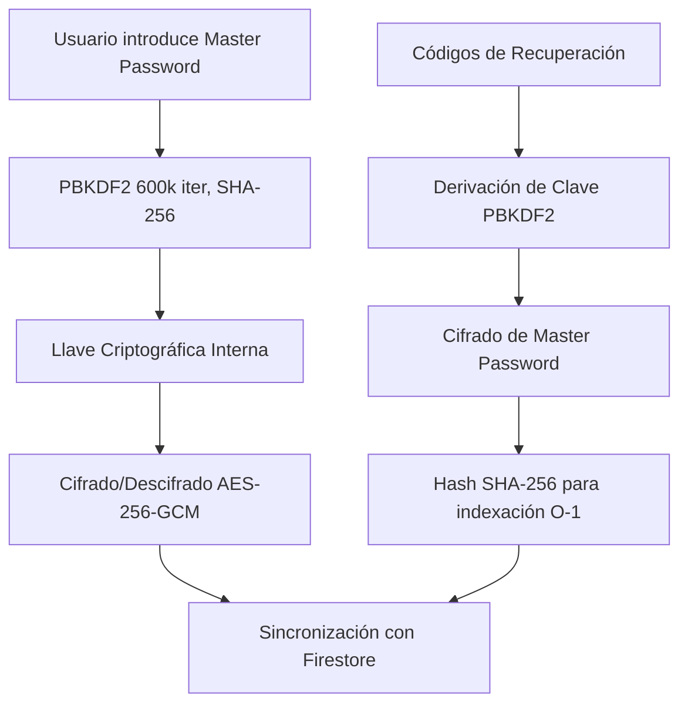

# MyPass

Un gestor de contraseñas seguro cifrado de extremo a extremo, creado con React Native (Expo), Firebase y la Web Crypto API. Toda la información sensible se encripta en el lado del cliente con AES-256-GCM antes de siquiera salir del dispositivo. La Contraseña Maestra (Master Password) nunca es almacenada, expuesta ni transmitida.

---

## Tabla de Contenidos

1. [Visión General de la Arquitectura](#visión-general-de-la-arquitectura)
2. [Pila Tecnológica](#pila-tecnológica)
3. [Estructura del Proyecto](#estructura-del-proyecto)
4. [Diseño Criptográfico](#diseño-criptográfico)
5. [Características](#características)
6. [Backend de Firebase](#backend-de-firebase)
7. [Internacionalización](#internacionalización)
8. [Guía de Inicio Rápido](#guía-de-inicio-rápido)
9. [Scripts Disponibles](#scripts-disponibles)
10. [Pruebas (Testing)](#pruebas-testing)
11. [CI/CD (Despliegue Continuo)](#cicd)
12. [Consideraciones de Seguridad](#consideraciones-de-seguridad)
13. [Licencia](#licencia)

---

MyPass sigue una arquitectura de conocimiento cero (Zero-Knowledge). El servidor nunca tiene acceso a las contraseñas en texto plano. Cien por ciento del cifrado y descifrado ocurre de forma exclusiva en tu propio dispositivo de cliente, usando la seguridad nativa del teléfono/navegador o Web Crypto API.



La contraseña maestra es importada como un material de llave nativa inextraíble de PBKDF2 y se mantiene viva bajo la reactividad de React estrictamente durante el transcurso activo de la sesión. Jamás se escribirá bajo ninguna circunstancia dentro de `localStorage`, `sessionStorage` o almacenamiento permanente. El sistema de recuperación cifra la clave maestra con el código elegido, permitiendo restaurar el acceso sin comprometer la seguridad.

---

## Pila Tecnológica

| Capa | Tecnología |
|-------|-----------|
| Frontend | React Native 0.83, Expo SDK 55, TypeScript 5.9 |
| Diseño | Fuentes Outfit & Plus Jakarta Sans, Iconos Vectoriales (Feather) |
| Enrutamiento | Expo Router (file-based routing) |
| Backend | Firebase (Autenticación, Firestore, Almacenamiento "Storage", Cloud Functions v2) |
| Criptografía | API Web Crypto (PBKDF2, AES-256-GCM) |
| Pruebas (Test) | Jest 29, ts-jest |
| CI/CD | GitHub Actions (revisión de sintaxis "lint", testing y despliegue automatizado) |
| Región | europe-southwest1 |

---

## Estructura del Proyecto

```
my-pass/
  app/                          # Pantallas del Router de Expo (enrutado basado en carpetas)
    _layout.tsx                  # Layout principal (Autenticadores + Contraseñas Maestras + Proveedores Locales)
    index.tsx                    # Punto de Entrada del código (verifica logeos y reenvía)
    (auth)/                      # Archivos de grupo de Autenticación
      _layout.tsx
      login.tsx                  # Inicio de Sesión de E-mail/Contraseña y vía Google OAuth
      register.tsx               # Registro de cuentas y verificación
      verify-email.tsx           # Panel de Verificación de cuentas
    (app)/                       # Área Privada protegida (requiere Logear y Contraseña Maestra)
      _layout.tsx                # Modelo Modal Guardián para forzar a dar la Contraseña Maestra
      dashboard.tsx              # Dashboard del Baúl (buscador de registros, catalogación...)
      add.tsx                    # Menu de insertar nueva contraseña
      edit/[id].tsx              # Menu de edición personal
      activity.tsx               # Censor Histórico (El registro e historial de la cuenta)
      settings.tsx               # Opciones y Ajustes
      backup.tsx                 # Exportador para salvar tu cuenta en un JSON
      password-history.tsx       # Navegador que guarda y muestra versiones viejas de una clave editada
  src/
    components/
      MasterPasswordModal.tsx    # Modal protector de accesos y configuración inicial de claves maestras
      PasswordCard.tsx           # Componente inyector del objeto de contraseña (tarjeta)
      PasswordForm.tsx           # Los módulos y generadores visuales de contraseñas robustas
      CategoryFilter.tsx         # Filtrado superior (Pastillas en el header visual)
    config/
      firebase.ts                # Claves maestras y App Check de la vinculación a Firebase
    context/
      AuthContext.tsx             # Estado de autenticaciones del usuario
      MasterKeyContext.tsx        # Contenedor temporal reactivo de tu llave criptográfica
    crypto/
      encryption.ts              # Reglas AES-256-GCM para el tratamiento de archivos y text/planos
      keyDerivation.ts           # Funciones de PBKDF2 e iteraciones criptográficas de fortalecimiento
    hooks/
      usePasswords.ts            # Utilidad general y CRUD (Create, Read, Update, Delete)
    i18n/
      index.ts                   # Herramientas de multi-lenguaje (useI18n)
      en.ts                      # Diccionario Estadounidense
      es.ts                      # Diccionario Español
    services/
      authService.ts             # Funciones a Firebase Auth + 2FA y setup Multifactores
      auditLogService.ts         # Escritura silenciosa del registro del Censor
      passwordService.ts         # Funciones nativas de búsqueda, duplicados...
      recoveryService.ts         # Motor matemático y creación de Códigos de Respaldo
      totpService.ts             # Motor HMAC-SHA1 nativo para Doble Factor (TOTP)
      settingsService.ts         # Lógicas para tu configuración privada y tiempos inactivos
      storageService.ts          # Permisos con la subida a Firebase (Attachments)
      vaultService.ts            # Herramienta de Cambios Completos o reinserciones (Cerrar Baúles, etc.)
    types/
      index.ts                   # Interfaces Generales TypeScript / Mapas
    utils/
      passwordGenerator.ts       # Mezclador Pseudo-Aleatorio inquebrantable
      theme.ts                   # Mapa Base del Estilo CSS Nativo de React
  functions/
    src/
      index.ts                   # Funciones alojadas en la Nube (Gatillos de firebase y métricas en vivo)
  tests/                         # Módulo entero de la Batería Automática de Pruebas
  firestore.rules                # Cortafuegos (Firewall) preestablecido subido a Firestore
  storage.rules                  # Reglas del Firewall Storage
  firestore.indexes.json         # Filtros indexados en la nube
  firebase.json                  # Puertos base de la conexión JSON de tu proyecto web
```

---

## Diseño Criptográfico

### Derivación de Clave

- Algoritmo: PBKDF2
- Hash: SHA-256
- Iteraciones: 600,000 (Recomendación certificada OWASP 2023)
- Sal (Salt): 16 bytes, aleatorios matemáticos, inyectados de forma puramente aleatoria unívoca y distintiva a cada encriptación manual que realices de hoy y mañana
- Salida (Output): Encriptación Base y Llave AES a 256 bits

### Cifrado

- Algoritmo: AES-256-GCM
- IV (Vector de Inicialización): 12 bytes
- Etiqueta de Autenticador: 128-bit (integrado de base en el estándar del GCM)
- Cada entrada del Baúl posee obligatoriamente su propia mezcla única. Encriptar lo mismo 20 veces soltará 20 variables ilegibles totalmente distintas, asegurando cero similitudes estadísticas y evadiendo análisis estadístico de bases.

### Recuperación de Alta Velocidad (O(1))

- Los códigos de recuperación no se iteran uno a uno al validar. Se genera un **Hash SHA-256** del código introducido que actúa como una "llave de búsqueda" instantánea en Firestore.
- Esto permite que, independientemente del número de códigos, la validación sea inmediata y segura, ya que el servidor solo ve el hash, no el código en sí.

### Cifrado de Archivos Adjuntos

- Cualquier archivo PDF, imagen de tarjeta, etc., está condicionado e insertado enteramente bajo la bóveda algorítmica de AES-256-GCM.
- Formato: `[sal (16 bytes) | IV (12 bytes) | texto cifrado]`
- Tamaño máximo del archivo adjunto: 5 MB (bloqueado bajo las reglas inquebrantables de Firebase Storage para evitar desbordes monetarios y ataques de re-subida).

### Ciclo de vida de tu "Contraseña Maestra"

1. El usuario digita su Contraseña Maestra y este se verifica con tu modelo.
2. Contraseña normalizada y purificada mediante estándar (NFKC) transformándose al material en memoria virtual.
3. Se reserva en el state (estado temporal de React JS)
4. React desecha las credenciales a la hora de darle "Salir", "Bloquear Manual", Al cerrar la vista del navegador o si saltan los 10/15 minutos de inactividad que tú mismo marcas en tus Ajustes.
5. Empleamos un verificador validado internamente para saber si introdujiste o no bien la validación de contraseñas contra base local *sin recurrir y sin mandar* jamás contraseñas o copias cifradas por aire, eliminando la exposición de robos.

---

## Características

### Gestor de Contraseñas
- Almacenamiento Criptográfico con protocolo AES-256-GCM.
- Un menú generador aleatorizado, incluyendo carácteres fuertes que tú moldees.
- Avisador progresivo de debilidades de la contraseña.
- Soporte e ingreso de: Correo, Usuario, URL y categoría.
- Inserción de "Attachments" o Archivos Adjuntos incrustados en cajas encriptadas bajo llave.
- Censor y alerta duplicada.
- Fechas de expiración pre-establecidas por el propietario para exigir la rotación por medio de un aviso directo en el panel del Dashboard.
- Autoguardado instantáneo e histórico completo por si alteraste por error una contraseña sensible, pudiendo revertir la copia.

### Seguridad Exclusiva (Arquitectura MFA "In-House")
- **Doble Autenticación Descentralizada (TOTP)**: No depende de Firebase Auth Identity Platform (evitando cuotas de pago). Utiliza la librería `otpauth` para validación matemática local.
- **Secretos 2FA Encriptados Asimétricamente**: El código base "Authenticator" de 20 bits en Base32 (`otpauth://`) devuelto al emparejar un dispositivo (ej. Google Authenticator o Authy), no se almacena en texto plano en la nube. ¡Queda automáticamente cifrado al vuelo bajo tu misma Contraseña Maestra (AES-256-GCM) dentro de tu perfil `Settings` de Firestore!
- **Sistema de Recuperación Maestro**: Códigos Aleatorios Unívocos que funcionan mediante **Cifrado Anidado**. Tu Contraseña Maestra se cifra con una clave derivada del Código de Recuperación (PBKDF2). Esto permite que, si olvidas tu Contraseña Maestra, puedas recuperarla introduciendo el código válido. El sistema local descifrará la Contraseña Maestra original y restaurará el acceso completo al baúl.
- Portapapeles volátil, elimina las contraseñas al copiado luego de medio minuto para evitar pegados o robos invisibles.
- Las Contraseñas enseñadas y expuestas a ojos desnudos frente a pantalla, se encriptan al texto asterisco con un lapso máximo de seguridad luego del pulsado.
- Borrado Seguro Estricto (Necesitas identificarte explícitamente y requerirá re-autenticar de fondo).

### Respaldo de Banco Local (Backup JSON Downloadable)
- Exportar o migrar baúles offline directos bajo Google Functions bajo verificación de propiedad estricta
- Insertador / importador en base
- Log auditado de quién o a dónde o en qué huso horario ha exportado copias de tus llames

### Ajustes Globales
- Opción extrema que ejecuta un vaciado algorítmico al vuelo que recodifica enteritas todas tus contraseñas albergadas cambiando dinámicamente tu código Maestro anterior por el Nuevo sobre cada línea en caso de emergencia si detectaste una exposición potencial y un adversario conoce tu Contraseña Maestra actual.
- Control a destajo del Lenguaje, Tiempos de inactividad de sesión.
- Internacionalizaciones totales ES/EN.
- Cierre voluntario global irreversible (eliminar cuenta).

### El Censor de Rastros y Auditados (Audit-Log Visual Screen)
- Te deja un rastro claro del quién y del cuándo ocurrió cualquier movimiento.
- Puedes clasificar entre cambios de Ajuste, Autenticaciones, o inserciones en contraseñas y cuándo pasó.
- Rastro absoluto inyectado incluso mediante Functions directas. Trazando hasta copias a tu llave de borrado o cambio maestro global.

---

## Backend de Firebase

### Funciones Cloud 2nd. Gen bajo `europe-southwest1`:

| Herramienta | Acción (Gatillo) | Significado e intenciones de fondo |
|----------|---------|-------------|
| onUserCreated | Auth (beforeUserCreated) | Inicia el Metadata y los Ajustes base un microsegundo antes que caigas logeado la primera vez |
| onPasswordCreated | Firestore (onCreate) | Contadores de base paralelos al registro de tu documento |
| onPasswordDeleted | Firestore (onDelete) | Substracción y reajuste contable en un evento disparador en borrado de baúles o auditorías |
| exportVaultBackup | Callable | Asegura que fuiste tú bajo API la exportación manual solicitada y provee un JSON |
| health | HTTP GET | Comprobadores de Salud directos |

### Colecciones del Firestore en Nube (Diseño de base de datos)

| Lógica | Descripciones |
|------|-------------|
| users/{uid}/passwords/{id} | Base para Entradas de claves encriptadas herméticas |
| users/{uid}/passwords/{id}/history/{hid} | Cola o Anidaciones y subarchivos que actúan adjuntos hacia el registro historial base bloqueados solo-adición o adición ciega "Append-only" (No hay deletes posibles aquí) |
| users/{uid}/auditLog/{id} | Rastros del Log Censor (Solo añadidas) |
| users/{uid}/metadata/profile | Controlados por Functions in-natos (Acceso lectura-limitado o Solo lectura del cliente) |
| users/{uid}/settings/preferences | Tus propios Lenguajes de plataforma / etc. |
| users/{uid}/recoveryCodes/{id} | Códigos Secretos cifrados base bajo llaves dinámicas |

### Reglas Criptográficas y Cortafuegos Oficial base del servidor y Almacenamiento "Cloud Firebase" y App Firebase Firestore

Asegurado estricta y rígidamente aislando a clientes paralelos y negando a la cuenta misma a leer o entrometerse más allá que sí mismo.

- Base Universal (`request.auth.uid == userId`)
- Colecciones base y Adición ciega, historial bloqueado y "solo escritura y read-only". Las funciones del Backend resuelven la autenticidad real para evitar inserción o corrupción forzada falsa por consolas locales sin la Key y control estricto de pesos (Limites a Archivos cifrados del Firestore e impidiendo envíos manuales y peso no-oficialmente comprobados de `Storage limit + 5.0 mb max bloqueable`).
- Resto de rutas: Default deny false, a todo y para siempre jamás sin validaciones del Servidor de Reglas limitando la superficie de tu cuenta Web.

---

### Módulo de "TOTP Nativo" Integrado (Adiós Identity Platform)
Se ha liberado al proyecto y a su propietario de depender de la infame cuota económica de Identity Platform / Cloud Logging para el Multi-Factor `(auth/billing-not-enabled)`.
Gracias a la incorporación nativa de `totpService.ts` bajo la matemática del motor TS HMAC-SHA1 (`otpauth`), la barrera del "Segundo Paso" reside pura y rígidamente en la bóveda de entrada de React (`_layout.tsx`), justo después de tu Contraseña Maestra, validando su temporalizador (+30s de varianza tolerada) antes de soltar la memoria descriptiva en RAM de tu Token Master para exponer el Dashboard. No hay interacciones web ni SMS interceptables: Pura matemática criptográfica local aislada.

---

## Internacionalización

Se ha estructurado bajo librerías y hooks locales sin cargas por redes (para alivianar los costos y descargas pesadas globales):

- Localizado en: `src/i18n/en.ts` / y el paquete `src/i18n/es.ts`.
- Contenedores (`Provider`) en todo el enrutado App bajo react `I18nProvider`.
- Exposición global sobre interfaces puras e incorporables, `t("string")` incluyendo traducciones métricas contables o variables internas dinámicas y pluralistas (Ej. `t("key", { count: 3 })`).
- Persisten como ajustes del Firebase, sin descuidarse en cada Refresh desde tus datos de `getSettings()`.

---

## Guía de Inicio Rápido

### Prerequisitos:

- Un sistema Node.js versión `18+` o equivalente/reciente
- Una capa de administrador Node.js npm versión `9+` (Manager)
- Firebase CLI se instala como dependencia local del proyecto con `npm install`
- Tener cuenta y un Panel Creado Oficial o Propio en *Firebase Cloud Web Console* provistos con Cloud Storage / Funciones Firestore con Auth integrados de la Plataforma Global.

### Compilar Proyecto

```bash
git clone https://github.com/josemgarciar/my-pass.git
cd my-pass
npm install
cd functions && npm install && cd ..
```

### Configurar la Base en Nube

1. Extrae e ingresa los Configs en `src/config/firebase.ts`.
2. Actualiza `YOUR_RECAPTCHA_ENTERPRISE_SITE_KEY` y re-ingresa la autenticadora tuya empresarial de Check Verify / o encripta para desarrollo y extráelo como nulo o "desactivo local".
3. Prohíbe tu base de datos y adjunta tu Firewall subiendo sus protecciones con: `npx firebase-tools deploy --only firestore:rules`
4. Aplica límite de pesaje de imágenes con `npx firebase-tools deploy --only storage`
5. Compila y monta a la nube tus gatillos programados Cloud del histórico y Json Exportador por comandos internos, usando:`npx firebase-tools deploy --only functions`

### Depuración Local o Correr React Expo

Usando Terminal Powershell, inicia todo la rama web o depurativa expo (Y presiona "W" bajo compilación o ábrelo directamente interactuando por app local al móvil o con Expo CLI de Google Store para iOS y la variante para compilaciones de Expo GO Emulator OS en Android):
```bash
npm start
```

Arrancar los emuladores manualmente:
```bash
npm run emulators
```

---

## Scripts Disponibles Automáticos

| Pila Local `Script` | ¿En qué resulta esto? |
|--------|-------------|
| `npm start` | Corre tu máquina local compiladora Base CLI de la aplicación / Expo Local y redes portátiles |
| `npm run web` | Expo (Para Web y DOM HTML5 Reactivos) |
| `npm run android` | Desfogue nativo Expo Mobile (Adentrándose con SDK Android Debug) |
| `npm run ios` |  Inyectables en la IOS Virtual SDK para Macs (Swift) |
| `npm test` | Arranca Firebase Emulator Suite y ejecuta unitarias + e2e contra emuladores |
| `npm run test:coverage` | Revisión total para la validación de qué % de la APP ha sido logeada y confirmada libre de caídas/cortes y Bugs |
| `npm run test:crypto` | Pruebas Matemáticas AES/PBKDF2 para comprobaciones matemáticas puras sin necesidad de renderizar vista o HTML |
| `npm run emulators` | Lanza una simulación para Firebase (No corrompes tu Base en línea ni gastarás cobros a Firebase o peticiones al mes de gratis o limitativas ni usarás tus bases maestras en pruebas) |
| `npm run lint` | Limpiadores Sintácticos Automáticos para validarte errores simples TS / JS |

---

## Pruebas (Testing)

El panel incorpora por defecto (+35) sets matemáticos preescritos aseguradores integrados contra desastres (Coverage y Suite Jest) para auditar toda validación antes de cometer una producción o un pase a Main Git, con comprobación minuciosa que testan a nivel local y puro sobre memoria la total confirmación del PBKDF2/Cifrados AES en Auth Flows y seguridad Firestore de la cuenta o para contraseñas de contraseñas.
Para certificar el testing general ejecuta el testeo: 

```bash
npm test
```

---

## CI/CD (Despliegue Continuo con Github)

El Repositorio Original provee en el Flow Acciones (Actions Github Integrado) un modelo automático que valida su código interno por si has tocado código y luego mandas un Pull Request en rama (Automáticamente tu github probará la cobertura, revisará tus Lint errores y desplegará producción solamente en RAMA Principal Master - Main) sin fallas humanas no revisadas previamente, aportando paz mental en compilados de final-use app products y webhosting.

---

## Consideraciones de Seguridad Específicas Recopiladas

1. Capa de Arquitectura Restringida ("Zero Knowledge"): Tu hosting servidor o base remota ajena **no visualizará de base ni extraerá** en ningún transcurso legal un solo JSON textual o legibilidad externa hacia contraseñas de usuario, la ofuscación matemática en los payloads garantiza el total desuso al momento de caídas del Auth Servidor a mano de vulnerables ciber-ataques mundiales desde afuera contra Firebase o descuidos ajenos. NUNCA SERÁ ACCESIBLE para terceros. Ningún empleado tiene tampoco visualización al panel ni administradores en Google Cloud platform o My-Pass directores a cargos. Todo usuario posee y carga en sus hombros con la totalidad, y la salvaguarda, inexpugnable e inaccesible base de llaves al cliente local, el final del flujo es la posesión privada y propia del portador. 
2. Protegida in-extractionem: Utilizando JavaScript Object Key y su propiedad interna `CryptoKey(non-extractable: true)`, se ha sellado cualquier tipo de script malintencionado cross-site o exportaciones que logren robar de memoria la llave desencriptadora base. ¡Ni el mismo dueño puede imprimir sobre logs una llave "extractable"! Todo es tratado como magia encajonada.
3. Factorización masiva preeminente bajo validación al derivado nativo base recomendado por OWASP y las reglas anti-brute force implementando sobre el hash y PBKDF un retardo interno en su encriptación sumido en `600,000 interacciones por pasada`. Forzar contraseñas maestras bajo fuerza bruta algorítmica y física costaría en GPU y tiempos astronómicos incontables, invalidando totalmente y protegiendo un eventual exfiltrado remoto de la contraseña a los servidores firebase ante robos.
4. Sal unívoca generada matemáticamente al vuelo con IVs en inyecciones AES asegurando que, inclusive la misma contraseña calcada grabada en My-Pass 10 veces en días y horas distintas e inyecciones distintas o incluso guardada por distintos clientes de nube usando credenciales y plataformas base... **JAMÁS** revelará un mismo correlato y no caerán sobre análisis cibernéticos de base estadista e "IV Tamper".
5. Autoetiquetas confirmatorias (Authentication Tags bajo esquemas GCM de validaciones Cifrador - Mensaje Descifrador) previene cualquier intruso de cambiar e inyectar al servidor firebase letras o carácteres sobre tu propia contraseña de base para corromper tus logeos impidiendo de golpe desencriptar nada ("Tamper Detection fall"), ya que altera su firma. El ataque a integridad es por lo tanto, imposible bajo AES-GCM.
6. Pantallazos o distracciones públicas o salidas al café resueltas; el tiempo Auto-Lock, si detienes el contacto físico a base con el terminal, cerrando todo herméticamente a cal y canto desde código cerrado por tiempos limitantes a voluntad tuya bajo ajustes visuales. Y si copias bases e IDs desde el botón nativo, en 30 segundos, el Portapapeles será sobre-rescrito vaciando todo desde la RAM, logrando nulificar robos de tu buffer base o los teclados nativos, sumando, al oscurecido o "Auto-Hidden Timer", en visiones donde tengas abierta y leas a ojo un secreto explícito destapando su contenido numérico real local y se borra visualmente autoaplicando otra vez el cerrado al 30s de haberla destapado en público. 
7. **Recuperación con Fallback**: Se proveen códigos de recuperación cifrados con Clave Maestra. Si el usuario pierde el dispositivo 2FA, puede usar un código para recuperar la clave maestra y así recuperar su bóveda. JAMÁS se rompe el "Zero Knowledge", ya que sin el código físico, nadie (ni Google ni nosotros) puede descifrar la clave maestra guardada.

---

## Licencia

Proyecto con licencia Privada bajo el formato: "Solo Derechos de uso de cliente cerrado o Reservado Completo sin derechos de modificación de usos comerciales", sin responsabilidades derivadas expresamente descritas. Todos los derechos registrados y reservados para uso personal / portfólio.
